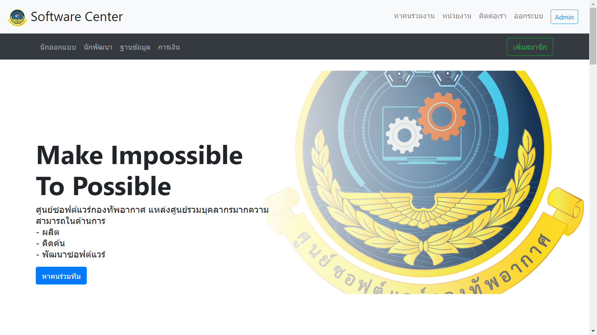
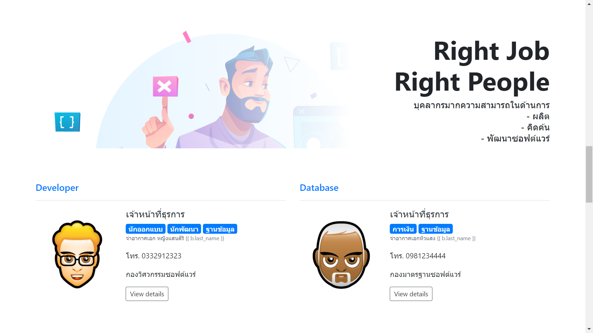

# contact_app

=======
ใครที่สนใจจะใช้ docker run env clone ไปได้เลยครับ
มีขั้นตอนแค่
  - สร้างไฟล์ docker-compose.yml ไปไว้ที่เดียวกับ ||main_project|| คือ own_info
  - copy text ในไฟล์ docker-compose.yml (open by note.txt ก็ได้)ไปใส่ .yml ที่เราสร้างไป
  - จากนั้นสั่งที่Terminal >> docker-compose up

ลิ้งเริ่มต้น  - /

register เพื่อใช้งานด้วยค่าบ